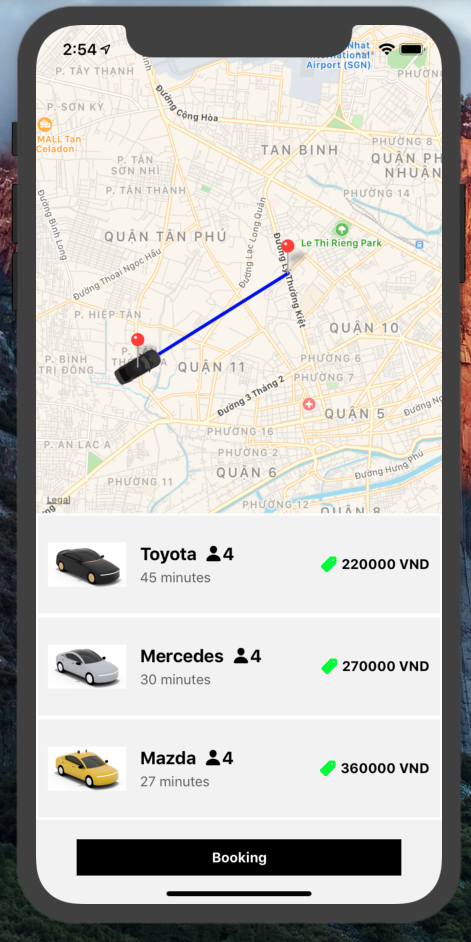
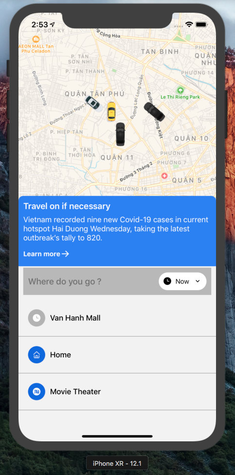

# React Native Uber Clone

<div style="display:flex">
  
  
</div>


## 1.Technical specification:

- Language : Typescript
- Framework : React Native
- 3rd party Libraries : 
  - expo-location
  - react-navigation
  - react-native-maps
=======
## 1.Packages


```
"@react-native-community/masked-view": "0.1.10",
    "@react-navigation/native": "^5.9.3",
    "@react-navigation/stack": "^5.14.3",
    "expo": "~40.0.0",
    "expo-location": "~10.0.0",
    "expo-status-bar": "~1.0.3",
    "react": "16.13.1",
    "react-dom": "16.13.1",
    "react-native": "https://github.com/expo/react-native/archive/sdk-40.0.1.tar.gz",
    "react-native-gesture-handler": "~1.8.0",
    "react-native-google-places-autocomplete": "^2.1.3",
    "react-native-maps": "0.27.1",
    "react-native-maps-directions": "^1.8.0",
    "react-native-reanimated": "~1.13.0",
    "react-native-safe-area-context": "3.1.9",
    "react-native-screens": "~2.15.2",
    "react-native-web": "~0.13.12"
```

## 2.Project contains the following features implemented:

- [X] Get current position
- [X] Car types
- [X] Draw routing
- [X] Destination  
- [ ] Get My Profile
- [ ] Request Email Verification
- [ ] Complete Email Veirication
- [ ] Update My Profile
- [ ] Toggle Driving Mode
- [ ] Report Location / Orientation
- [ ] Add Place
- [ ] Edit Place
- [ ] Delete Place
- [ ] See Nearby Drivers
- [ ] Subscribe to Nearby Drivers
- [ ] Request a Ride
- [ ] Get Nearby Ride Requests
- [ ] Subscribe to Nearby Ride Requests
- [ ] Subscribe to Ride Status
- [ ] Get Chat Room Messages
- [ ] Subscribe to Chat Room Messages
- [ ] Send a Chat Message
- [ ] Get Ride History
- [ ] See Ride Detail
- [ ] Generate JWT
- [ ] Verify JWT